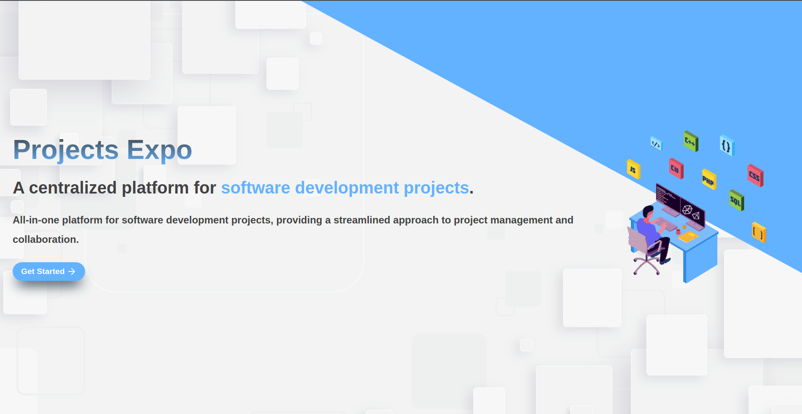
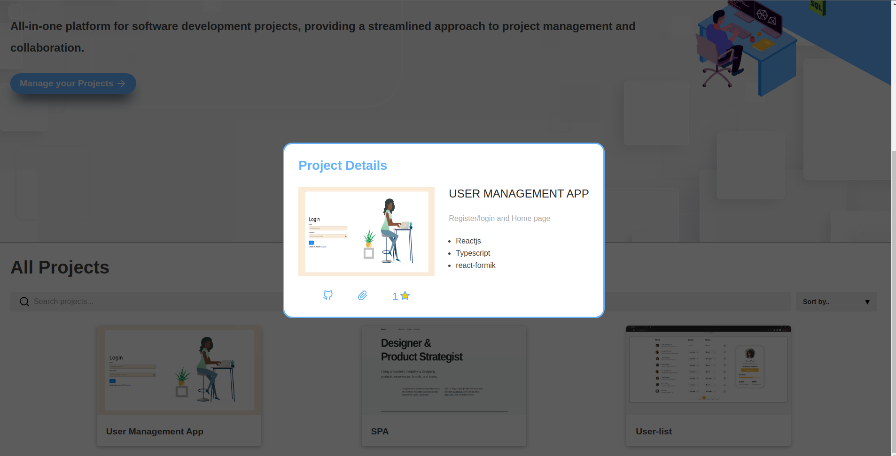
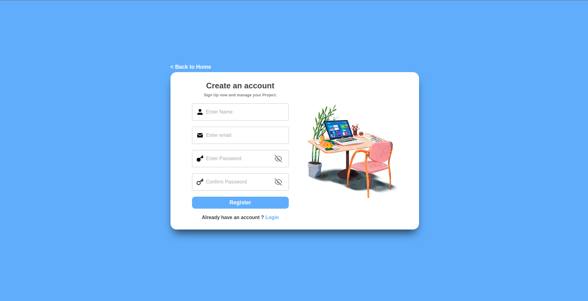
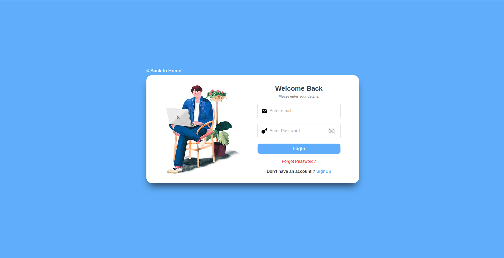
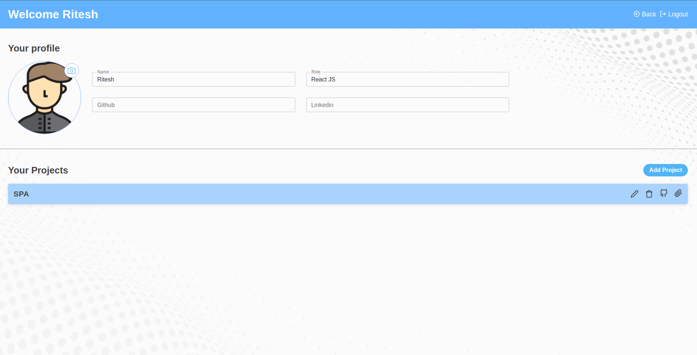
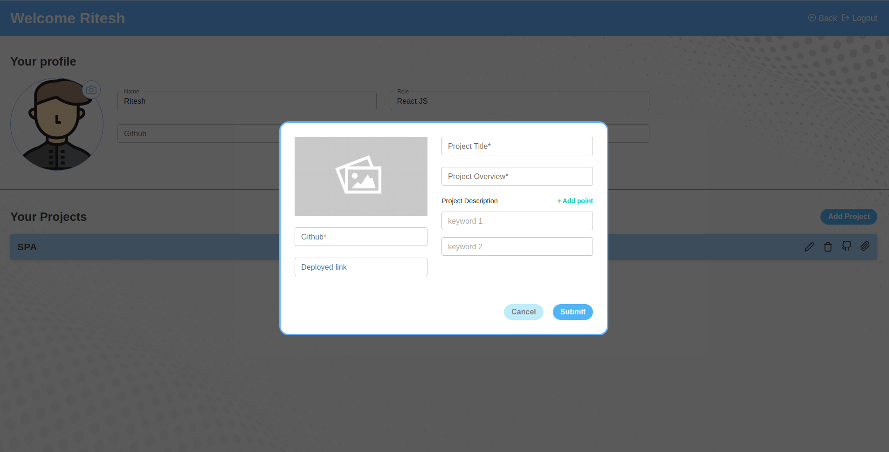

# <p align="center">Project Expo</p>

## 🚀 Live Demonstraion

- [Project Expo](https://project-expo-vp.netlify.app/)

## Project Setup :

- clone github repository

  - `git clone https://github.com/jupinlathiya/Project-Expo.git`

- create .env file in root directory

  - add Your web app's Firebase configuration in .env file

- install all dependencies

  - `npm install`

- run project in development mode
  - `npm run dev`

## Description:

- Project objective is to develop a project management web app that allows users to seamlessly add and manage their projects. The app will provide essential features such as project description, keywords, photos, GitHub repository integration, and the ability to add a hosted link if the project has been deployed.

## Key Features:

- User Authentication
  - To ensure data security and enable personalized project management, users will be required to login with their credentials.
- Project Listing
  - Even without logging in, visitors should be able to view all the projects listed on the website.
- Project Submission
  - Logged-in users will have the privilege to add their projects to the platform.
  - They will be able to provide a detailed description, relevant keywords for search ability, upload project photos for visual representation, and link their GitHub repository for code access.
  - Additionally, users will have the option to include a hosted link if their project has been deployed.
- Rating
  - logged in user can like projects.
- User Dashboard
  - A personalized user dashboard will be provided, allowing users to manage their projects efficiently. They can edit project details, update information, delete projects if necessary.
- Responsive Design
  - Develop a responsive and user-friendly interface that works well on different devices and screen sizes.

## Tech-Stack & Libraries

- HTML/CSS
- Typescript
- ReactJS
- Firebase
- netlify
- react-router-dom
- @reduxjs/toolkit
- react-confirm-alert
- react-feather
- react-spinner
- react-toastify

## SnapShot of Project

### Home Page



### Show All Project


### Project Modal



### SignUp Page



### Login Page



### Account Page



### Add Project



```

```
